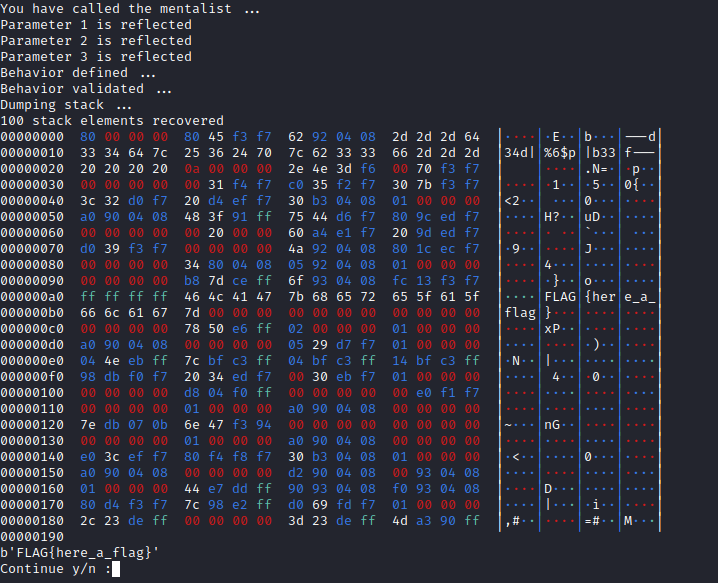
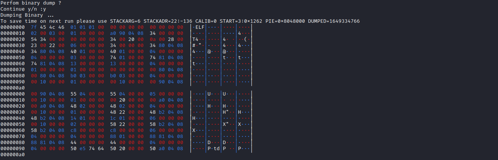

# ffstr

# Description

This tools aims to solve easy format string challenges proposed on CTF.

- Automatic server response behavior assessment
- Detection of format string injectable inputs
- Dump Stack
- Stack Analysis
- Find binary header "\x7fELF"
- Dump Binary
- Read all available symbols


## Usage

python3 ffstr.py options

 - ``BINARY`` : Provides connection information to the challenge, as ip:port
 - ``ELF``    : In case the challenge binary is provided, avoid dumping the binaru
 - ``BITS``   : 32 or 64 bits, by default 64
 
 ```bash
python3 ffstr.py BINARY=127.0.0.1:1337 BITS=64 ELF=./ffstr64
python3 ffstr.py BINARY=127.0.0.1:1337 BITS=32 ELF=./ffstr32
```

## Installation

```bash
git clone https://github.com/Electro-Bug/ffstr.git
cd ffstr
```
## Screenshot

Stack read function



Binary dump



## Demo
Soon
