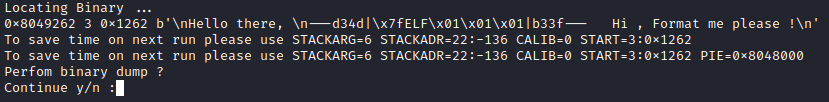
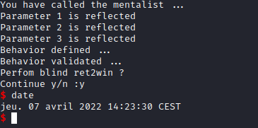
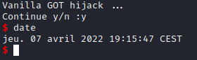
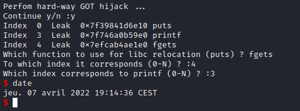

# ffstr

# Description

This tools aims to solve easy format string challenges proposed on CTF.

- Automatic server response behavior assessment
- Detection of format string injectable inputs
- Dump Stack
- Stack Analysis
- Find binary header "\x7fELF"
- Dump Binary
- Read all available symbols
- Perform ret2win attack
- Inject shellcode on the stack
- Hijack GOT knowing the LIBC and the binary
- Hijack GOT having a dumped binary


## Usage

python3 ffstr.py options

 - ``BINARY`` : Provides connection information to the challenge, as ip:port
 - ``ELF``    : In case the challenge binary is provided, avoid dumping the binary
 - ``BITS``   : 32 or 64 bits, by default 64
 - ``TOUT``   : Timeout in seconds
 - ``RL``     : Ask user confirmation every N message send
 - ``DBG``    : Activate debugging output

 ```bash
gcc  -m32 -fno-stack-protector -z execstack -z norelro -g -no-pie ./lab/ffstr.c -o ./lab/ffstrlab32
gcc  -fno-stack-protector -z execstack -z norelro -g -no-pie ./lab/ffstr.c -o ./lab/ffstrlab64

socat TCP-LISTEN:1337,reuseaddr,fork EXEC:"./lab/ffstrlab32" &
socat TCP-LISTEN:31337,reuseaddr,fork EXEC:"./lab/ffstrlab64" &
```

## Installation

```bash
git clone https://github.com/Electro-Bug/ffstr.git
cd ffstr
./run.sh
```

## Example of use after full run

```
python3 ffstr.py BINARY=127.0.0.1:1337 BITS=32 RL=10000 TOUT=0.15 STACKARG=6 START=3:0x120f PIE=0x8048000 STACKADR=22:-136 CALIB=0 ELF=./lab/ffstrlab32 LIBC=libc6-i386_2.33-6_amd64.so

python3 ffstr.py BINARY=127.0.0.1:31337 RL=10000 TOUT=0.05 STACKARG=7 START=17:0x1290 PIE=0x400000 STACKADR=18:-128 CALIB=0 ELF=./lab/ffstrlab64 LIBC=libc6_2.33-6_amd64.so

```
## Screenshot

Stack read function


Locate binary



Binary dump


Return to Win



Vanilla GOT



GOT hijack hardway



